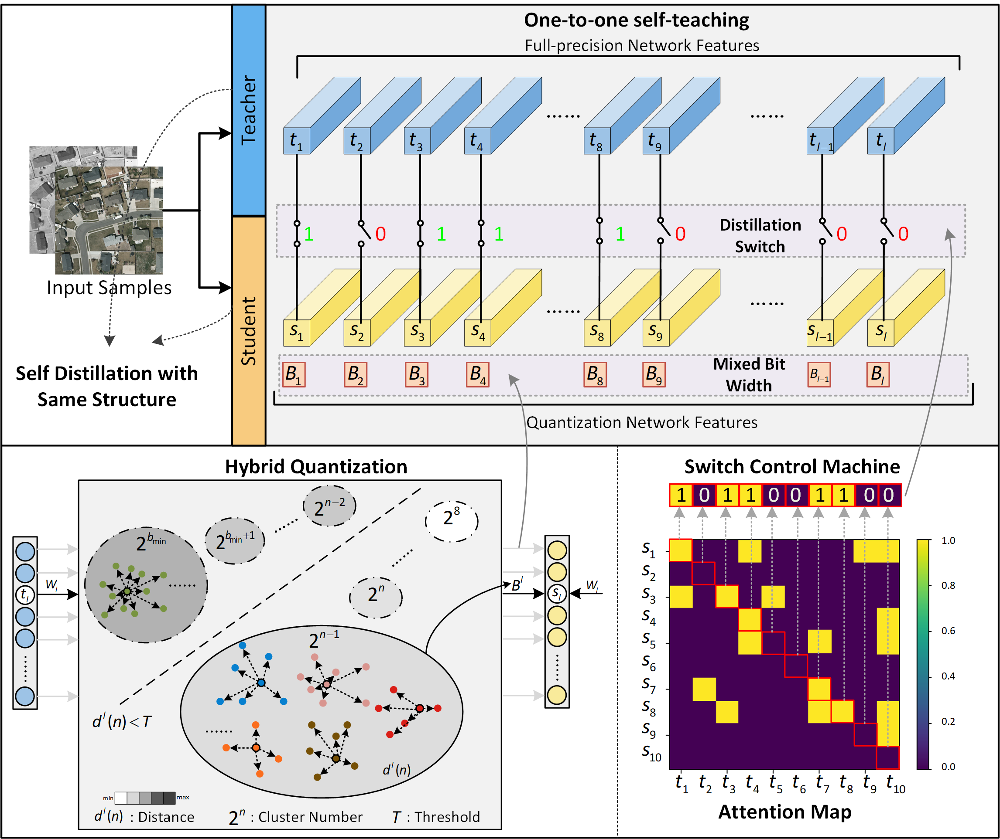

# Guided Hybrid Quantization for Object Detection in Multimodal Remote Sensing Imagery via One-to-one Self-teaching
⭐ The code matches our paper [article](https://arxiv.org/abs/2301.00131)! ! !⭐ 


 If our code is helpful to you, please cite:
```
@article{zhang2022GHOST,
  title={Guided Hybrid Quantization for Object Detection in Multimodal Remote Sensing Imagery via One-to-one Self-teaching},
  author={Jiaqing, Zhang and Jie, Lei and Weiying, Xie and Yunsong, Li and  and Xiuping, Jia},
  journal={arXiv preprint arXiv:2301.00131},
  year={2022}	
}
```

<p align="center">  </p>

## Requirements

```python
pip install -r requirements.txt
```

## Use GHOST

### 1. Prepare training data
- 1.1 The publicly available dataset VEDAI designed for multimodal remote sensing image object detection is adopted in our experiments. In addition to validation on the multimodal object detection dataset, three single modal datasets (DOTA, NWPU  and DIOR ) are utilized in experiments to verify the generation of our proposed algorithm.
- 1.2
  Download VEDAI data for our experiment from [baiduyun](https://pan.baidu.com/s/1L0SWi5AQA6ZK9jDIWRY7Fg) (code: hvi4)


### 2. begin to train 
##### Here we take the NWPU dataset as an example.
- 2.1 Train a small full-precision model as the pretrained teacher model ([*SuperYOLO*](https://github.com/icey-zhang/SuperYOLO))
  
  ```python
  python train.py --data data/NWPU.yaml --cfg models/SRyolo_noFocus.yaml --ch 3 --input_mode RGB --batch-size 8 --epochs 100 --train_img_size 1024 --test_img_size 512 --device 0
  ```
  
     **result**: You will get a *weight_SuperYOLO*, which serves as a network of teachers to guide the optimization process of quantifying the network.
  ######
- 2.2 Get a small mixed-bit model (*GHOST*) by completing n-bit quantization under the guidance of pretrained teacher via distillation
  
  ```
    <!-- note: --weights teacher==weight_superYOLO --weight==weight_SuperYOLO -->
  ```
  ```python
  python quantization_conv_automix_autodis.py --distillation 6 --inter_threshold 0.1 --device 0 --kd_weight 400 --epochs 100 --data data/NWPU.yaml --weights_teacher runs/train/use/exp/weights/best.pt --weights runs/train/use/exp/weights/best.pt --cfg models/SRyolo_noFocus.yaml --ch 3 --input_mode RGB --batch-size 8 --hyp data/hyp.scratch.yaml --train_img_size 1024 --test_img_size 512
  ```
    **result**:You will get a *weight_GHOST*.

### 3. test
- 3.1  test Parameters and mAP of the SuperYOLO
    ```
    <!-- note: --weights == weight_GHOST --full weights==weight_SuperYOLO  -->
    <!-- note：if you want to get n-bit SuperYOLO you can set -- bit_width==n  -->
    ```
    ```python
   python test_flops.py --weights runs/train/use/exp/weights/best.pt --full_weights runs/train/use/exp/weights/best.pt --bit_width 32 --input_mode RGB 
   ```
    ```python
    python test.py --data data/NWPU.yaml --weights runs/train/exp/weights/best.pt --batch-size 4 --device 0 --iou-thres 0.6
    ```

- 3.2 test Parameters and mAP of the GHOST
    ```python
    python test_flops.py --weights runs/train/use/exp1/weights/best.pt --full_weights runs/train/use/exp/weights/best.pt --input_mode RGB --inter-threshold 0.1
    ```
    ```python
    python test.py --data data/NWPU.yaml --weights runs/train/exp1/weights/best.pt --batch-size 4 --device 0 --iou-thres 0.6
    ```
### 4. If you want use other datasets,you can try :

[The DOTA, DIOR and VEDAI](https://github.com/icey-zhang/GHOST/blob/main/Fig/README.md)

## Time
2023.2.14 open the code

## Acknowledgements

This code is built on [YOLOv5 (PyTorch)](https://github.com/ultralytics/yolov5). We thank the authors for sharing the codes.

Thanks for the code of dota dataset processing [DOTA_devkit_YOLO](https://github.com/hukaixuan19970627/DOTA_devkit_YOLO).

## Contact
If you have any question, please contact me with email (jq.zhangcn@foxmail.com).
